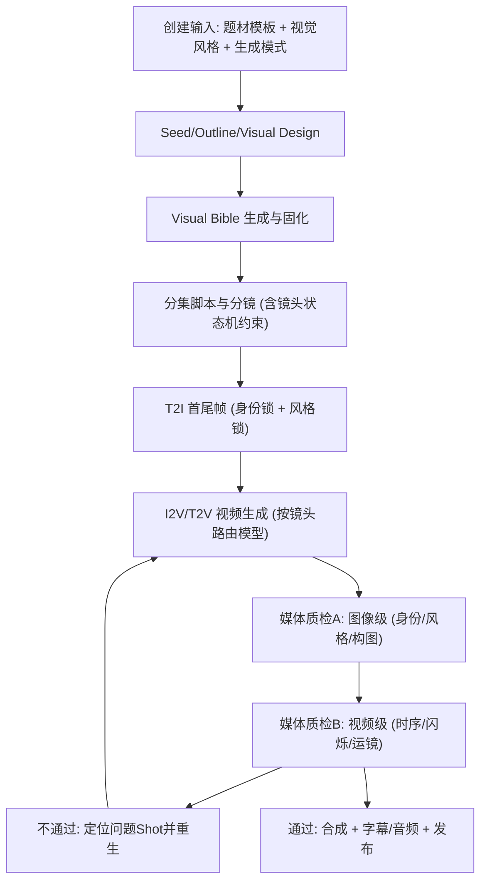

# 短剧生产链路 V2 蓝图（面向高质量成片 + 高效率 + 好体验）

## 1. 目标（必须量化）

- 人物一致性通过率（关键镜头）>= 95%
- 风格一致性通过率（集级）>= 90%
- 首轮成片通过率 >= 70%
- 平均重生次数 <= 1.8 次/关键镜头
- 用户从“创建”到“首集可播放”时长下降 30%

## 2. 新流程（端到端）



## 3. 核心改造点

### 3.1 Visual Bible（全剧视觉圣经）

新增全局资产契约（每剧唯一）：

- `identityPack`: 每个角色 3 张锚点图（正面/3-4侧面/半身或全身）+ face DNA 文本
- `stylePack`: 风格 token（aesthetic/render/texture/color/light）+ style 参考图
- `cameraPack`: 该剧镜头语言上限（常用角度、运镜节奏、转场策略）

作用：

- Agent 统一引用同一契约，避免 prompt 漂移
- 媒体生成和质检使用同一基准，形成闭环

### 3.2 题材模板对流程和提示词的影响（显式化）

- 题材模板不只影响 seed，要影响 4 层：
- 脚本规则（冲突节奏、信息密度）
- 分镜规则（场景类型 -> qualityTier）
- 媒体策略（分辨率/重试/并发）
- 质检阈值（如古装 close-up 更严格）

落地方式：

- `genreTemplate.seedHints` -> `storyRules/cameraRules/qcRules/mediaPolicy`

### 3.3 人物一致性（从“软提示”升级为“硬门禁”）

- 生成前：
- 每个 Shot 必须绑定 `characterIds + variationIds + identityPackVersion`
- 生成后：
- 计算 `identityScore`（与角色锚点图比对）
- 低于阈值自动重生，不进入下游

建议阈值：

- golden: `identityScore >= 0.82`
- standard: `identityScore >= 0.75`
- filler: `identityScore >= 0.68`

### 3.4 风格一致性（风格锁）

- 每个 Shot 绑定 `stylePackVersion`
- 生成后计算 `styleScore`（色彩/材质/光影偏差）
- 偏差过大自动重生

建议阈值：

- golden: `styleScore >= 0.80`
- standard: `styleScore >= 0.72`
- filler: `styleScore >= 0.65`

### 3.5 镜头与运镜（状态机约束）

在 Storyboard 阶段加入硬规则：

- 同场景禁止跳轴
- 景别变化步进：`ECU/CU -> MCU/M -> MW/W`，不允许无理由跨两级
- 高情绪镜头才允许激烈运动（whip_pan/handheld）

输出 `cameraContinuityFlags`，供媒体阶段和质检阶段复用。

## 4. Agent 提示词改造模板（关键片段）

### 4.1 VisualAssetDesigner

- 强制输出：
- `identityPack`（角色锚点描述 + 变体规则）
- `stylePack`（可机读 token）

关键规则：

- “角色 face DNA 永久不可改，变体只允许改服装/状态，不改骨相特征”

### 4.2 StoryboardDirector

- 额外输入：`cameraPack + stylePack + identityPack`
- 强制输出字段：
- `qualityTier`
- `characterVariationIds`
- `cameraContinuityFlags`
- `regenPriority`

关键规则：

- `visualPrompt` 禁止脸部细节
- `firstFramePrompt/lastFramePrompt` 强制身份锁 + 风格锁

### 4.3 ScriptReviewer（升级为双层评审）

- 文本层：剧情/节奏/钩子
- 视觉层（新）：镜头语言可执行性、生成风险预判

输出新增：

- `mediaRiskScore`
- `highRiskShots[]`（直接给媒体阶段提速）

### 4.4 新增 MediaQCReviewer（建议）

- 输入：首尾帧、视频片段、identity/style 契约
- 输出：
- `identityScore/styleScore/motionScore/flickerScore/readabilityScore`
- `failReasons[]`
- `regenHints`

## 5. 后端字段与数据结构（V2 建议）

## 5.1 DramaState 新增

```ts
visualBible: {
  version: string;
  identityPack: Array<{
    characterId: string;
    faceDna: string;
    anchorImages: { faceFront: string; face34: string; upperOrFull: string };
    variationPolicy: string;
  }>;
  stylePack: {
    styleTokens: string[];
    styleRefImages: string[];
    colorLutHint?: string;
  };
  cameraPack: {
    preferredAngles: string[];
    movementPolicy: string[];
    continuityRules: string[];
  };
}
```

## 5.2 Shot 新增

```ts
mediaPlan: {
  modelRoute: "portrait" | "action" | "wide" | "filler";
  regenPriority: "high" | "medium" | "low";
  qcThresholds: { identity: number; style: number; motion: number };
}
```

## 5.3 ShotMediaEntry 新增

```ts
qc: {
  identityScore?: number;
  styleScore?: number;
  motionScore?: number;
  flickerScore?: number;
  readabilityScore?: number;
  passed: boolean;
  failReasons: string[];
  attempts: number;
}
```

## 6. 模型策略（提升效果与效率）

按镜头类型路由，不再全局一刀切：

- `portrait/close-up`: 人脸稳定优先（低并发+高阈值）
- `action`: 动作连续优先（时间一致性优先）
- `wide`: 场景氛围优先（可降身份阈值）
- `filler`: 成本优先（低分辨率/低重试）

补充：

- 维持现有 profile 机制，但扩展为“镜头路由配置”
- 把 `candidateCount` 真正用于 golden 多候选选优

## 7. 用户体验改造（避免“流程乱”）

## 7.1 入口收敛

将“生成分集”和“生成媒体”整合为：

- `一键生成成片`
- `仅生成文本`
- `仅生成媒体`

## 7.2 进度可解释

每个阶段显示：

- 当前节点
- 质量门禁结果（通过/重生次数）
- 失败原因（可执行建议）

## 7.3 问题可定位

工作台提供：

- `问题 Shot 列表`
- `一键重生问题 Shot`
- `锁定镜头后不覆盖`（全链路生效）

## 8. 分期实施（建议）

### P0（1-2 周，先提质）

- 上线 `visualBible` 基础字段
- 媒体阶段传入 `characterRefs/styleRefs`
- golden 启用多候选选优
- 增加 `identityScore/styleScore` 门禁

### P1（2-3 周，提稳）

- 上线 `MediaQCReviewer`（视频级质检）
- 上线镜头状态机约束（StoryBoard 输出）
- 一键“问题 Shot 重生”

### P2（2 周，提体验）

- 工作台“一键成片”
- 失败解释与推荐修复
- 质量看板（剧级趋势）

## 9. 验收指标（上线后看板）

- `identity_fail_rate`（按 tier 分层）
- `style_drift_rate`
- `avg_regen_attempts_per_shot`
- `first_pass_episode_rate`
- `time_to_first_playable_episode`
- `user_manual_edit_ratio`

